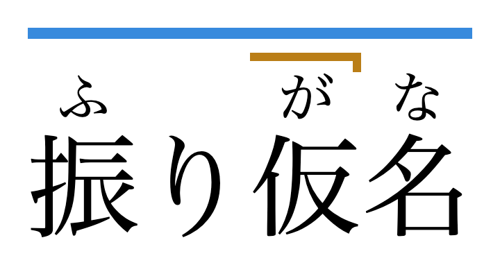

# ja-pitch-accent

Standalone pitch-accent lookup and HTML formatting extracted from [10ten Japanese Reader](https://10ten.life/en/), with furigana support added.

Completely vibe-coded. Use at your own discretion!

## Examples

Basic binary pitch:

<picture>
  <source media="(prefers-color-scheme: dark)" srcset="docs/example-binary-dark.png">
  <source media="(prefers-color-scheme: light)" srcset="docs/example-binary-light.png">
  
</picture>

Furigana with downstep notation:

<picture>
  <source media="(prefers-color-scheme: dark)" srcset="docs/example-furigana-dark.png">
  <source media="(prefers-color-scheme: light)" srcset="docs/example-furigana-light.png">
  
</picture>

Furigana with downstep notation (more than one possible accent):

<picture>
  <source media="(prefers-color-scheme: dark)" srcset="docs/example-furigana-multiple-dark.png">
  <source media="(prefers-color-scheme: light)" srcset="docs/example-furigana-multiple-light.png">
  
</picture>

## CLI

```sh
npx ja-pitch-accent <spelling> [reading] [--html]
```

For example, to get a JSON array (see below), run:

```sh
npx ja-pitch-accent 閉める
```

To print HTML instead:

```sh
npx ja-pitch-accent 閉める --html | head -n 1
```

When there are multiple dictionary entries, we print one per line. We use `head -n 1` in this example to only print the first.

## JavaScript API

### Installation

```sh
npm install ja-pitch-accent
```

### Usage

```ts
import { formatJaPitchAccentHtml, getJaPitchAccent } from 'ja-pitch-accent';

const matches = getJaPitchAccent('閉める', 'しめる');
const html = formatJaPitchAccentHtml(matches[0]);
```

`getJaPitchAccent(spelling, reading?)` takes a Japanese word, and optionally a `reading` to narrow the results to a specific reading. It returns an array of matches. The first match is usually the best.

```ts
type JaPitchAccentMatch = {
  accent: number;
  partOfSpeech: string[];
  reading: string;
  spellings: string[];
};
```

`accent` is the pitch-accent downstep position counted in mora:

- `0` means heiban.
- `1` means atamadaka.
- `2` or greater means the pitch drops after that mora.
- If `accent === mora count`, the pattern is odaka.

Some readings have more than one accent. Each accent is returned as a separate match with the same `reading`, in dictionary order. For example, `getJaPitchAccent('立ち上がる')` returns two matches for たちあがる, with `accent` values `0` and `4`.

`partOfSpeech` is empty unless an accent applies only to certain parts of speech. For example, `getJaPitchAccent('かちかち')` includes one match for the reading かちかち with `accent: 0` and `partOfSpeech: ['adj-na']`, and another with `accent: 1` and `partOfSpeech: ['adv', 'n']`.

`formatJaPitchAccentHtml(match, renderCharacter?)` renders the same binary pitch-accent outline style used by 10ten. The optional `renderCharacter(character, index)` callback can return custom HTML for each kana character.

You can change the styling by setting any of the following CSS variables (defaults shown):

```css
.ja-pitch-accent {
  --ja-pitch-accent-border-color: currentColor;
  --ja-pitch-accent-border-style: dotted;
  --ja-pitch-accent-border-width: 1.5px;
  --ja-pitch-accent-display: inline-block;
  --ja-pitch-accent-margin-bottom: 0.25rem;
}
```

`formatJaPitchAccentFuriganaHtml(word, accents, options?)` renders a word with furigana and colored pitch-accent marks above it. It can show several accents at once. The first is drawn slightly thicker.

```ts
const accents = getJaPitchAccent('取り消す', 'とりけす').map((match) => match.accent);
const html = formatJaPitchAccentFuriganaHtml('取[と]り 消[け]す', accents);
```

`word` is Anki-style furigana, with a space before a kanji that follows kana. Kana-only words such as `'しめる'` are drawn without furigana. Pass `{ color: false }` to draw the marks in the text color, or `{ rtScale }` (default `0.5`) to change the furigana size. The marks take no layout space, so leave room above the text, for example with a larger `line-height`.

CSS variables (defaults shown):

```css
.ja-pitch-accent-furigana {
  --ja-pitch-accent-furigana-heiban-color: #378ADD;
  --ja-pitch-accent-furigana-atamadaka-color: #E24B4A;
  --ja-pitch-accent-furigana-nakadaka-color: #BA7E17;
  --ja-pitch-accent-furigana-odaka-color: #639922;
  --ja-pitch-accent-furigana-offset: 0.1em;
  --ja-pitch-accent-furigana-gap: 0.2em;
  --ja-pitch-accent-furigana-stroke: max(2px, 0.06em);
  --ja-pitch-accent-furigana-stroke-alt: max(1.5px, 0.045em);
  --ja-pitch-accent-furigana-inset: max(3px, 0.075em);
}
```

### Browser use

This package can be used in the browser as-is. However, your bundle size will be several megabytes, as the entire dataset JSON is included.

## Contributing

### Data

To rebuild the dataset from 10ten, run:

```sh
git submodule update --init --recursive
pnpm run build-data
```

By default that reads from the vendored 10ten submodule at `vendor/10ten-ja-reader/data/words.ljson`, but you can also pass an explicit source path and output directory to `scripts/build-dataset.ts`.

## Licensing

The package code is GPL-3.0-only.

The bundled generated dataset also carries upstream attribution/licence notices from the data sources used by 10ten, including JMdict/EDICT and pitch-accent data attributed by 10ten to Uros Ozvatic/Kanjium. See [NOTICE](/Users/primary/src/get-pitch-accent/NOTICE).
